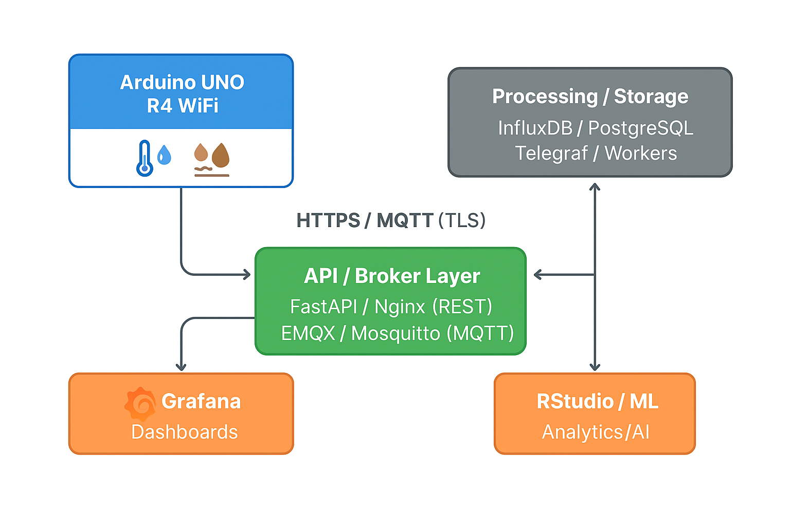

- BHCC STEM Club
UNO R4 WiFi • REST • MQTT • Security • Best Practices
APIs Overview for Arduino


<div class="frame">

Why APIs for Arduino? APIs (Application Programming Interfaces) are the
bridge between your Arduino and:

- Cloud services & databases (data logging, analytics, dashboards)

- Mobile / web apps (real-time monitoring & control)

- Other devices (gateway nodes, microservices)

**Smart Garden example**: DHT11 + soil sensor $`\rightarrow`$ publish
via API $`\rightarrow`$ store & visualize $`\rightarrow`$ alerts & ML
predictions.

</div>

<div class="frame">

API Communication Models

| **Type** | Protocol | Direction | When to use |
|:---|:---|:---|:---|
| **REST API** | HTTP/HTTPS | Client$`\rightarrow`$Server | Simple JSON posts, easy web backends (FastAPI/Flask/Supabase). |
| **MQTT API** | TCP/TLS | Pub/Sub (bi-dir) | Low-power IoT telemetry, scalable, commands via topics. |
| **WebSocket** | TCP | Bi-directional | Realtime dashboards pushing updates to browsers. |
| **GraphQL** | HTTP/HTTPS | Client$`\rightarrow`$Server | Query only the fields you need; less common on MCUs. |

</div>

# REST APIs

<div class="frame">

REST: Concept **Endpoints:** `/ingest`, `/telemetry`, `/status`
**Methods:** `GET, POST, PUT, DELETE`

<div class="block">

Typical flow

1.  Arduino formats sensor data as JSON.

2.  Sends HTTPS `POST` to server endpoint.

3.  Server authenticates (API key), validates schema, stores data.

4.  Optional: server responds with status or commands.

</div>

</div>

<div class="frame">

UNO R4 WiFi: Minimal HTTPS POST (REST) **Libraries**: `WiFiS3`,
`ArduinoHttpClient`

``` Arduino
#include <WiFiS3.h>
#include <ArduinoHttpClient.h>

const char* SSID = "YOUR_SSID";
const char* PASS = "YOUR_PASS";

const char* HOST = "api.example.com";
const int   PORT = 443; // HTTPS
const char* API_KEY = "YOUR_LONG_RANDOM_KEY";

WiFiSSLClient net;         // TLS
HttpClient    client(net, HOST, PORT);

void setup() {
  Serial.begin(115200);
  WiFi.begin(SSID, PASS);
  while (WiFi.status() != WL_CONNECTED) delay(250);
}

void loop() {
  String body = "{\"nodeId\":\"SOIL1\",\"temperature\":23.8,"
                "\"humidity\":41.2,\"soilMoisture\":0.31}";

  client.beginRequest();
  client.post("/ingest");
  client.sendHeader("Content-Type", "application/json");
  client.sendHeader("Authorization", String("Bearer ") + API_KEY);
  client.sendHeader("Content-Length", body.length());
  client.beginBody();
  client.print(body);
  int ok = client.endRequest();

  int code = client.responseStatusCode();
  Serial.println(code);
  client.stop();
  delay(5000);
}
```

</div>

<div class="frame">

FastAPI: Simple Ingest Endpoint (Server)

``` python
from fastapi import FastAPI, Request, HTTPException

app = FastAPI()
EXPECTED = "YOUR_LONG_RANDOM_KEY"

@app.post("/ingest")
async def ingest(req: Request):
    auth = req.headers.get("authorization", "")
    if not auth.startswith("Bearer ") or auth.split(" ", 1)[1] != EXPECTED:
        raise HTTPException(status_code=401, detail="invalid api key")

    data = await req.json()
    # TODO: validate schema & ranges, then write to DB
    return {"ok": True, "size": len(str(data))}
```

</div>

# MQTT APIs

<div class="frame">

MQTT: Concept

<div class="columns">

**Broker-centric pub/sub**

- Devices *publish* telemetry to topics.

- Dashboards/servers *subscribe* to topics.

- Lightweight, low bandwidth, great for fleets.

**Topic design**

``` 
bhcc/smartgarden/SOIL1/telemetry
bhcc/smartgarden/SOIL1/status
bhcc/smartgarden/SOIL1/command
```

**Flow**

``` 
[UNO R4] --publish--> [MQTT Broker]
      \                   /
       \--subscribe<-----/
           [Server/Dash]
```

</div>

</div>

<div class="frame">

UNO R4 WiFi: MQTT over TLS **Libraries**: `WiFiS3`, `ArduinoMqttClient`

``` Arduino
#include <WiFiS3.h>
#include <ArduinoMqttClient.h>

const char* SSID = "YOUR_SSID";
const char* PASS = "YOUR_PASS";
const char* BROKER = "broker.example.com";
const int   PORT   = 8883;  // TLS
const char* USER   = "SOIL1";
const char* TOKEN  = "YOUR_LONG_RANDOM_KEY";

WiFiSSLClient net;
MqttClient    mqtt(net);

void setup() {
  WiFi.begin(SSID, PASS);
  while (WiFi.status() != WL_CONNECTED) delay(200);

  mqtt.setId("uno-r4-soil1");
  mqtt.setUsernamePassword(USER, TOKEN); // API key as password
  while (!mqtt.connect(BROKER, PORT)) delay(500);
}

void loop() {
  mqtt.poll();
  mqtt.beginMessage("bhcc/smartgarden/SOIL1/telemetry", false, 1);
  mqtt.print("{\"t\":23.8,\"h\":41.2,\"s\":0.31}");
  mqtt.endMessage();
  delay(5000);
}
```

</div>

# WebSockets (optional)

<div class="frame">

WebSockets: When to Use

- Real-time dashboards pushing updates to browsers.

- For Arduino, typically proxied via a gateway (ESP32/PC server).

- Security and framing overhead can be higher than MQTT.

</div>

# Authentication & Security

<div class="frame">

API Keys & Practical Security **API key placement**

- HTTP header: `Authorization: Bearer `*`KEY`* (recommended)

- Query string: `?api_key=KEY` (only if service requires)

- MQTT username/password: `user=deviceId`, `pass=KEY`

**Checklist**

1.  Use **TLS** (HTTPS / MQTT over TLS).

2.  One **unique key per device**; rotate keys.

3.  Server-side **validation**: schema, ranges, rate limit.

4.  Include **timestamps**; reject stale data.

5.  Avoid printing secrets on Serial in production.

</div>

# Best Practices

<div class="frame">

Robustness & Data Quality

- **Retry buffers**: cache unsent readings when offline.

- **QoS 1** for MQTT telemetry; use retained only for last-known status.

- **Batch uploads**: send N readings per POST to reduce overhead.

- **Retention policies**: downsample older data in TSDB (e.g.,
  InfluxDB).

- **Observability**: add device status pings and error counters.

</div>

# Architecture

<div class="frame">

End-to-End Reference Architecture


</div>

# Practical Examples

<div class="frame">

Service Examples & Endpoints

| **Platform**            | Method | Example                               |
|:------------------------|:-------|:--------------------------------------|
| **ThingSpeak**          | REST   | `/update?api_key=XXX&field1=23.5`     |
| **Arduino IoT Cloud**   | MQTT   | `deviceId/variableName` (provisioned) |
| **Supabase (Postgres)** | REST   | `/rest/v1/sensors` (insert JSON rows) |
| **Custom (FastAPI)**    | REST   | `/ingest`, `/telemetry`               |

</div>

<div class="frame">

JSON Payload Template

``` JSON
{
  "ts": 1730132405,
  "nodeId": "SOIL1",
  "temperature": 23.8,
  "humidity": 41.2,
  "soilMoisture": 0.31,
  "vbat": 4.86,
  "rssi": -62
}
```

*Tip:* Keep field names short but clear; include a UNIX timestamp and a
device identifier.

</div>

# Troubleshooting

<div class="frame">

Common Issues & Fixes

| **Symptom** | Fix |
|:---|:---|
| **`connection failed` / timeouts** | Verify SSID/password, DNS/host, open outbound ports (443/8883). |
| **`401/403 Unauthorized`** | Check API key location (header vs query), token validity/rotation. |
| **Duplicate MQTT data** | Ensure retained flag is off for telemetry; use QoS1 only if needed. |
| **Malformed JSON** | Validate braces/quotes; avoid trailing commas; check decimal dots. |
| **Clock skew / stale data** | Sync NTP or include controller timestamp; reject stale on server. |

</div>

# Advanced Extensions

<div class="frame">

Beyond the Basics

- **OTA updates**: Arduino IoT Cloud or custom HTTPS fetcher.

- **JWT / HMAC**: signed requests (anti-replay, integrity).

- **Edge batching & compression**: send fewer, larger posts.

- **Alerts**: Grafana/Influx tasks or server rules (email/Telegram).

- **AI loop**: export to CSV $`\rightarrow`$ RStudio/ML $`\rightarrow`$
  predictions via API.

</div>

# Summary

<div class="frame">

Key Takeaways

- REST = simplest path to any web backend; MQTT = best for IoT scale.

- Use TLS, per-device API keys, and server-side validation.

- Design clean topics/endpoints and stable JSON schemas.

- Plan dashboards, retention, and ML integration from day one.

</div>

<div class="frame">

References

- Arduino Docs — `https://docs.arduino.cc`

- MQTT — `https://mqtt.org`

- ThingSpeak — `https://thingspeak.com/docs`

- InfluxData — `https://www.influxdata.com`

- FastAPI — `https://fastapi.tiangolo.com`

</div>

<div class="frame">

— BHCC STEM Club

</div>
