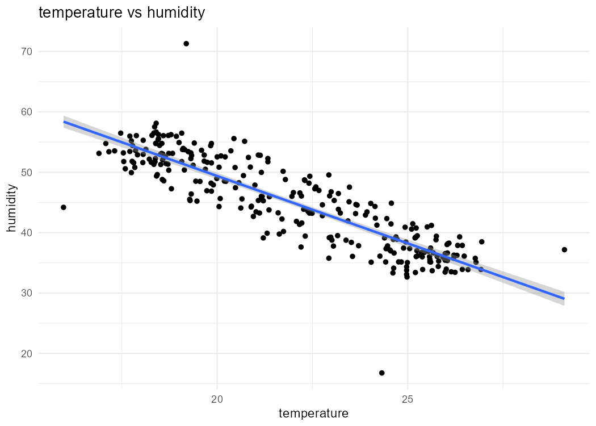
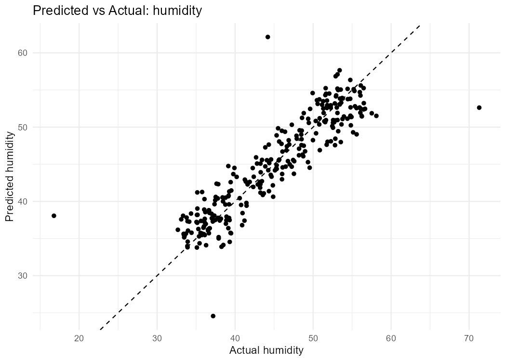

# **RStudio Presentation and Workflow Guide**  
Sensor Data Analysis using Sensor_Data.csv and Machine Learning (lm)  
Author:STEM Club — Bunker Hill Community College

# Objective

This guide demonstrates how to use RStudio to import sensor data,
summarize it, visualize relationships, and apply a simple machine
learning model (linear regression using `lm()`) to predict sensor
readings. The document serves both as a presentation and an
instructional manual for students and STEM Club members.

# Environment Setup

## Installing and Loading Packages

Open RStudio and execute the following lines in the console:

    install.packages(c("tidyverse", "lubridate", "janitor", "caret"))
    library(tidyverse)
    library(lubridate)
    library(janitor)
    library(caret)

These packages provide tools for data cleaning, visualization, and
machine learning.

## Folder Structure

Recommended project layout:

- `data/` — place `Sensor_Data.csv`

- `R/` — contains analysis scripts

- `figs/` — stores generated plots

- `reports/` — output documents or summaries

# Importing the Dataset

Place your CSV file in the `data/` directory and load it:

    path <- file.path("data", "Sensor_Data.csv")
    df <- read_csv(path) %>% janitor::clean_names()

    # Quick inspection
    glimpse(df)
    summary(df)

#### Tip:

`clean_names()` standardizes headers (e.g., converts `Temperature (C)`
to `temperature_c`).

# Descriptive Statistics

Compute the **sum**, **mean**, and **median** for each numeric column.
If a timestamp column exists, the median date is also computed.

    num_cols <- df %>% select(where(is.numeric))

    summary_tbl <- num_cols %>%
      summarise(across(everything(), list(
        sum = ~sum(.x, na.rm = TRUE),
        mean = ~mean(.x, na.rm = TRUE),
        median = ~median(.x, na.rm = TRUE)
      )))
    print(summary_tbl)

    # Median timestamp if present
    maybe_time <- df %>% select(matches("time|date|timestamp|datetime"))
    if (ncol(maybe_time) > 0) {
      tcol <- names(maybe_time)[1]
      tvec <- parse_date_time(df[[tcol]], orders = c("Ymd HMS", "mdY HM", "mdY"))
      med_time <- median(as.numeric(tvec), na.rm = TRUE) %>%
        as.POSIXct(origin = "1970-01-01", tz = "UTC")
      print(med_time)
    }

# Visualization

We create a scatter plot to explore the correlation between two key
sensor measurements (e.g., temperature and humidity):

    ggplot(df, aes(x = temperature, y = humidity)) +
      geom_point(color = "blue") +
      geom_smooth(method = "lm", col = "red") +
      theme_minimal() +
      labs(title = "Temperature vs Humidity", x = "Temperature", y = "Humidity")

# Linear Regression (Machine Learning Model)

We apply the linear model function `lm()` to predict humidity from
temperature or other predictors.

    model <- lm(humidity ~ temperature, data = df)
    summary(model)

    df$predicted <- predict(model, df)

    RMSE <- sqrt(mean((df$humidity - df$predicted)^2))
    R2 <- cor(df$humidity, df$predicted)^2
    cat("RMSE:", RMSE, "R²:", R2)

# Saving Visual Outputs

You can save the generated plots for reports or web dashboards:

    # Save the last plot
    if(!dir.exists("figs")) dir.create("figs")

    ggsave("figs/temp_vs_humidity.png", width = 7, height = 5, dpi = 150)

# RStudio Shortcuts

| **Action**                        | **Shortcut**     |
|:----------------------------------|:-----------------|
| Run selected code                 | Ctrl + Enter     |
| Insert assignment operator (`<-`) | Alt + -          |
| Comment / Uncomment line          | Ctrl + Shift + C |
| Run all code chunks               | Ctrl + Alt + R   |
| Reformat code                     | Ctrl + Shift + A |
| Find in file                      | Ctrl + F         |

# Common Issues

- Ensure columns used in `lm()` are numeric.

- Remove or impute missing values with `na.omit()`.

- Use `clean_names()` to avoid spaces or special characters in column
  names.

- Verify the correct date format before parsing.

# Next Steps

- Extend the model with multiple predictors:
  `lm(humidity   temperature + soil_moisture)`.

- Explore machine learning packages: `randomForest`, `xgboost`, or
  `caret::train()`.

- Automate periodic analysis using `R Markdown` or `knitr`.

*Prepared for:* STEM Club — Bunker Hill Community College  

