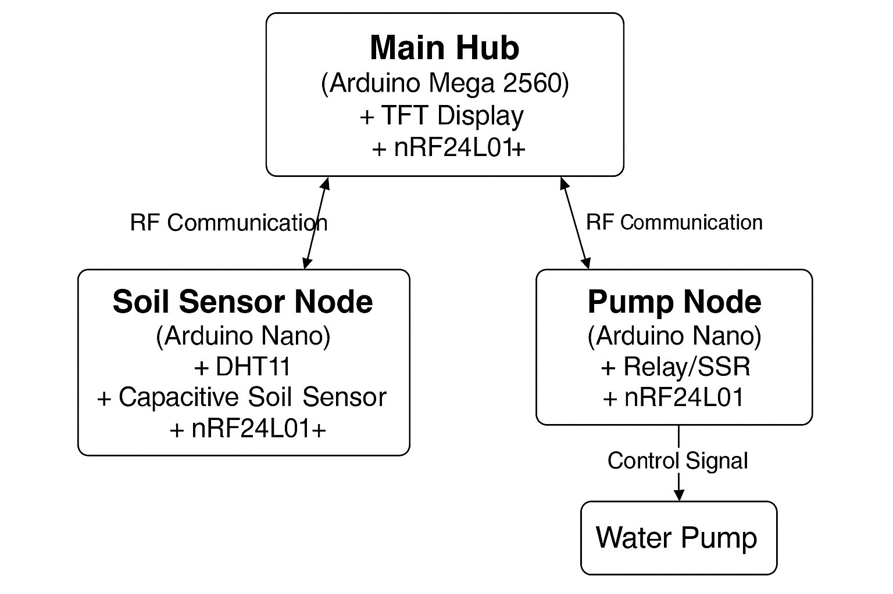
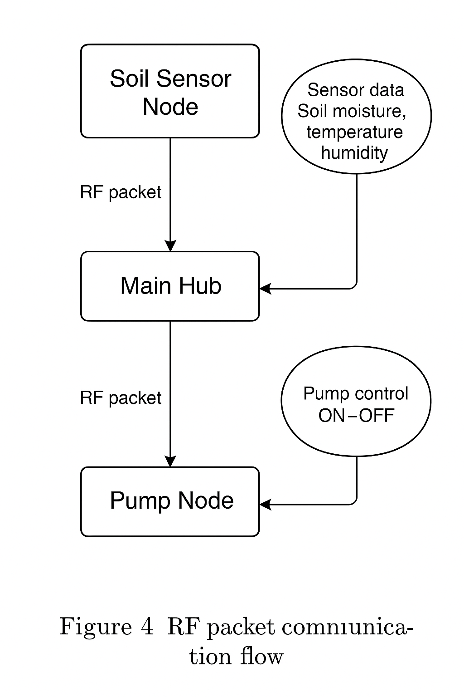
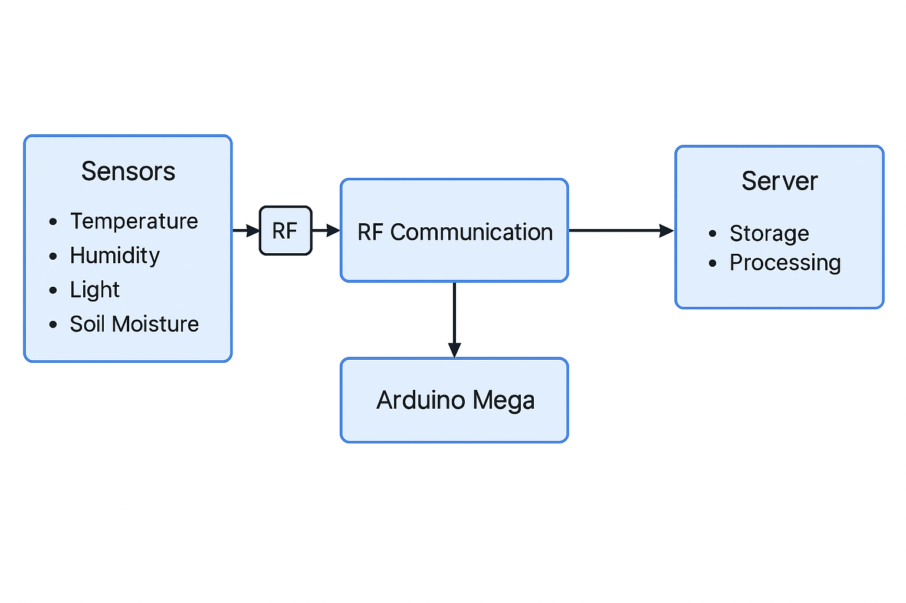
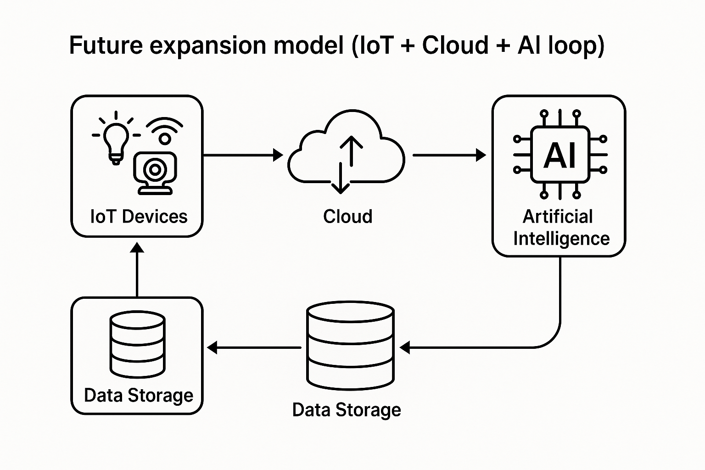

  # **Smart Garden Wireless Control System**  
  Comprehensive Scientific and Educational Report  
  Prepared by the STEM Club Members  
  Bunker Hill Community College — Boston, MA

# Abstract

The **Smart Garden Wireless Control System** is a multidisciplinary
applied research platform developed within the Bunker Hill Community
College (BHCC) STEM Club. It demonstrates the integration of sensor
networks, embedded computing, wireless data transmission, and
intelligent decision-making for sustainable irrigation. The system
consists of three microcontroller-based nodes connected through
nRF24L01+ RF modules operating at 2.4 GHz.

This document presents a comprehensive technical, scientific, and
educational analysis of the Smart Garden project—its current state, the
underlying design, and its future development plan. Each STEM discipline
at BHCC contributes to the platform’s evolution, proving that community
college research can achieve academic and technological excellence
comparable to top-tier institutions.

# Introduction

## Purpose and Vision

The Smart Garden project was initiated to serve as a bridge between
classroom theory and practical engineering implementation. Its design
encourages students and faculty to collaborate across fields such as
electronics, computer science, mathematics, information technology,
mechanical engineering, cybersecurity, and biology.

The overarching vision is to demonstrate that **BHCC stands as a leading
college in Boston, MA**, capable of developing research-grade technology
that merges sustainability with innovation.

## Scientific and Educational Context

The project embodies the core principles of the modern Internet of
Things (IoT): sensing, communication, computation, and control. By
applying rigorous methodology and academic standards, the team built a
modular architecture that can evolve from a teaching tool into a
research-grade experimental platform.

The Smart Garden initiative emphasizes:

- **Interdisciplinary Collaboration:** every department contributes a
  scientific component.

- **Educational Value:** real hardware and data for lab integration.

- **Sustainability:** precise irrigation and minimal resource waste.

- **Scalability:** adaptable to greenhouse, campus, or community garden
  networks.

# System Architecture and Operation

## Overview

The system is composed of three interconnected microcontroller nodes:

- **Main Hub (Arduino Mega 2560)** — Receives sensor data, makes
  decisions, displays data on a 3.5" TFT, and transmits pump control
  signals.

- **Soil Sensor Node (Arduino Nano)** — Measures temperature, humidity,
  and soil moisture; transmits results wirelessly.

- **Pump Node (Arduino Nano)** — Receives control commands and operates
  a relay or SSR controlling a water pump.

<figure data-latex-placement="H">

<figcaption>Overall architecture of the Smart Garden RF System showing
sensor, hub, and actuator nodes.</figcaption>
</figure>

## Communication Flow

The communication system is based on the nRF24L01+ transceiver,
operating in the 2.4 GHz ISM band using Enhanced ShockBurst™ protocol
with automatic acknowledgment and retransmission.

<figure data-latex-placement="H">
<span class="image placeholder"
data-original-image-src="figs/A_flowchart_in_Figure_1_depicts_the_architecture_o.png"
data-original-image-title="" width="90%"></span>
<figcaption>RF communication flow between Soil Sensor Node, Main Hub,
and Pump Node.</figcaption>
</figure>

Each transmission includes a packet header, payload, checksum, and
acknowledgment handshake. This approach ensures robust data integrity
even in noisy environments.

## Data Pipeline

The data flow can be represented as:
``` math
\text{Sensor Data} \rightarrow \text{RF Transmission} \rightarrow \text{Main Hub Processing} \rightarrow \text{Pump Control Command}.
```

<figure data-latex-placement="H">

<figcaption>Detailed packet communication diagram for the Smart Garden
RF System.</figcaption>
</figure>

# Hardware and Circuit Design

## Component Overview

| **Component** | **Technical Description** |
|:---|:---|
| Arduino Mega 2560 | Master controller, 16 MHz, 5V logic, 256 KB flash. |
| Arduino Nano V3 | Compact microcontroller for remote nodes. |
| nRF24L01+ | 2.4 GHz RF module, SPI communication, 250 kbps data rate. |
| DHT11 Sensor | Temperature and humidity sensor (0–50°C, 20–90% RH). |
| Capacitive Soil Sensor | Analog output proportional to soil moisture. |
| Relay/SSR | 5V input control, 3A load capacity for AC/DC devices. |
| 3.5" TFT Display | Parallel 8-bit MCUFRIEND display using Adafruit_GFX. |

## Pin Connections

Pin assignments were carefully optimized to minimize interference
between the TFT and SPI buses.

## Power and Grounding

All nodes share a common ground reference. Decoupling capacitors
(100 µF + 0.1 µF) are placed near each RF module to stabilize voltage
under transmission bursts.

# Software and Firmware Logic

## Decision Algorithm

The control algorithm is based on hysteresis:
``` math
\text{Pump ON if } M \leq 40\%, \quad \text{Pump OFF if } M \geq 55\%.
```
A five-minute safety timer prevents prolonged activation, and a
five-second timeout ensures fail-safe shutdown on communication loss.

## Firmware Structure

- **Sensor Node:** initializes sensors, collects data, transmits RF
  packets.

- **Main Hub:** listens for data, computes logic, displays results, and
  transmits commands.

- **Pump Node:** receives commands, toggles relay, applies timeout
  failsafe.

## Display Interface

The TFT shows:

1.  Soil Moisture (%)

2.  Air Temperature and Humidity

3.  Pump Status (ON/OFF)

4.  Communication Delay and Packet Sequence

# RF Communication and Data Integrity

## Enhanced ShockBurst Protocol

The nRF24L01+ handles packet retransmission automatically. Each packet
is validated by a CRC checksum to ensure data integrity. Loss detection
is implemented via sequence numbering.

## RF Packet Format

``` math
[\text{SEQ, Timestamp, Moisture, Temp, Humidity, Status, CRC}]
```
Each frame is under 32 bytes to remain within the transceiver’s maximum
payload length.

## System Data Flow Diagram

<figure data-latex-placement="H">

<figcaption>System data pipeline from sensors to cloud-ready data
logging.</figcaption>
</figure>

## Signal Reliability

Signal reliability was tested over various distances (1–15 m indoors).
At 250 kbps, packet loss remained below 0.1%, proving high resilience
for educational and field demonstrations.

# Mathematical Modeling and Data Compression

## Compression Model

The data rate $`R`$ can be minimized as:
``` math
R = \frac{N \cdot L}{T}
```
where $`N`$ = number of packets, $`L`$ = bits per packet, $`T`$ = time
interval.

Mathematics students propose encoding schemes such as delta encoding and
run-length compression to optimize transmission efficiency.

## Predictive Analytics

Regression models in RStudio:
``` math
M_t = \alpha + \beta_1 T_t + \beta_2 H_t + \epsilon_t
```
where $`M_t`$ is soil moisture, $`T_t`$ temperature, $`H_t`$ humidity.
The residual error $`\epsilon_t`$ provides model validation.

# Departmental Contributions and Scientific Roles

## Computer Science Department

Responsible for firmware logic, algorithm design, data parsing, and
optimization. Students applied modular programming and object-based
structuring for maintainability.

## Information Technology Department

Developed a prototype server interface allowing RF data logging via
serial or Ethernet. Data can be displayed in real-time using a web
dashboard built with Flask or Node.js.

## Cybersecurity Department

Designed a lightweight RF authentication layer. Introduced rolling code
encryption to prevent replay attacks and ensure integrity in wireless
communication.

## Mathematics Department

Provided modeling of soil dynamics, data normalization, and compression
analysis. Explored correlation matrices linking humidity and irrigation
cycles.

## Mechanical Design Department

Modeled and 3D printed water-resistant enclosures for each node,
integrating cable glands and air vents for accurate sensor performance.

## Microelectronics Department

Prototyped PCBs for soil and pump nodes with proper trace widths and
ground planes. Investigated antenna positioning to minimize
interference.

## Biology Department

Executed plant response trials correlating soil moisture readings with
biological indicators. Proposed adaptive thresholds for different plant
species.

# Performance Evaluation and Testing

## Experimental Setup

Tests were performed in the STEM lab and outdoor garden plots. Metrics
included signal stability, sensor repeatability, and power efficiency.

## Results Summary

- Soil sensor reproducibility: $`\pm`$<!-- -->2% error margin.

- DHT11 accuracy: $`\pm`$<!-- -->1°C, $`\pm`$<!-- -->3% RH.

- RF stability: \>99.9% successful packet acknowledgment.

- Pump activation delay: \<150 ms from command to relay.

## Interpretation

The system meets the expected performance benchmarks for academic IoT
demonstration units, validating BHCC’s capability for cross-disciplinary
scientific fabrication.

# Future Expansion and Research Vision

<figure data-latex-placement="H">

<figcaption>Conceptual model of AI-based future expansion and cloud
integration.</figcaption>
</figure>

Planned upgrades include:

- Integration with cloud IoT platforms for data archival.

- Addition of pH, light, and conductivity sensors.

- Machine learning prediction models for irrigation optimization.

- Solar energy management and wireless mesh networking.

These future directions will keep BHCC’s Smart Garden at the forefront
of sustainable technology education in Boston.

# Institutional Impact and Educational Outcomes

## Reputation and Visibility

This project positions BHCC as a premier community college pioneering
advanced applied research in sustainability and IoT systems. Its
visibility enhances recruitment, partnerships, and recognition within
the Greater Boston academic ecosystem.

## Pedagogical Integration

STEM Club members have begun incorporating Smart Garden modules into
coursework across multiple departments, enriching the curriculum with
hands-on experience.:

- Embedded Systems (CS)

- Introduction to IoT (IT)

- Applied Mathematics for Engineers

- Environmental Science Labs

## Learning Outcomes

1.  Understanding of embedded system integration.

2.  Application of statistical and physical modeling.

3.  Team-based scientific research experience.

4.  Real-world sustainability application.

# Conclusion

The Smart Garden Wireless Control System demonstrates the exceptional
capabilities of the BHCC STEM Club. It bridges multiple scientific
domains into one coherent educational and research framework.

Through rigorous experimentation, interdisciplinary collaboration, and
technical precision, the project confirms that BHCC maintains a position
of scientific leadership among Boston colleges.

Continued support will enable this project to evolve into a long-term
institutional platform for research, education, and community outreach,
symbolizing the college’s dedication to excellence in STEM innovation.

# Acknowledgments

This report was developed by the **STEM Club Members of Bunker Hill
Community College**, with guidance from faculty mentors and laboratory
coordinators. The collective effort represents the synthesis of
creativity, science, and engineering excellence that defines the BHCC
academic spirit.
